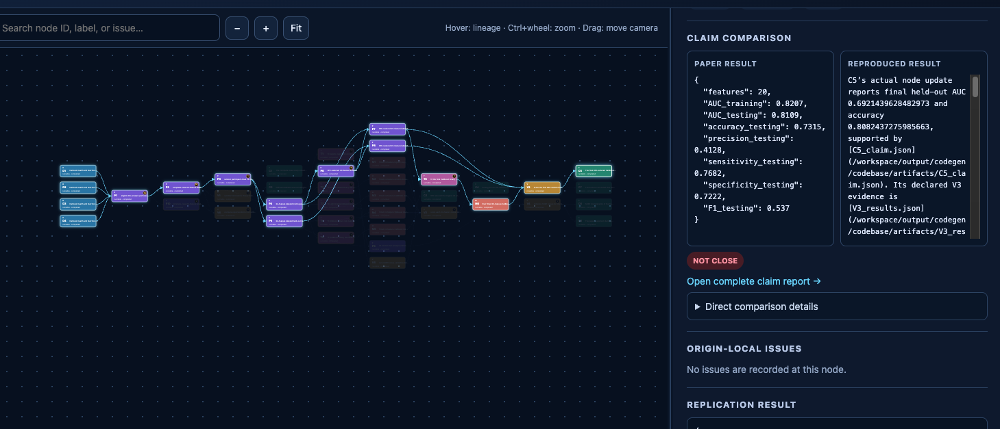

# MedAI

**Evidence-bound medical-paper replication and Auto Research**

  <a href="#english">English</a> · <a href="#中文">简体中文</a>

  

  <strong>Graph-native replication:</strong> edit experimental paths as structured nodes, then trace every final claim back through its evidence and node-level risks. <strong>图结构化复现：</strong>以结构化节点修改实验路径，并将每个最终结论沿证据链溯源到节点级风险。

---

# English

## Overview

MedAI is an evidence-bound harness for medical-paper replication and Auto Research, running in Docker. It turns a paper PDF, an optional source repository, and data into an executable claim-provenance graph, audited replication records, and claim- and artifact-level reports.

- **Graph-native replication:** MedAI decomposes the paper into a fine-grained D/P/T/M/V/C graph spanning datasets, preprocessing, training, trained-model artifacts, validations, and claims. Making experimental dependencies explicit helps surface replication details that a monolithic workflow can miss.
- **Structured revision and risk lineage:** Each material change becomes a node or path update, so an experiment can be revised without obscuring the rest of the workflow. Every final claim remains traceable through the exact evidence path that produced it, including issues originating at any upstream node and the claims they can affect.
- **Heterogeneous datasets:** MedAI is not restricted to one dataset or one table format. It is designed for the structured clinical, EHR/longitudinal, time-series, medical-imaging, omics, text, and other research inputs required by a paper—provided that complete paper-required source files and a usable runtime are supplied.
- **Prediction and statistical analysis:** The same graph represents supervised-prediction and statistical-analysis paths; statistical paths do not need training or model nodes.
- **Scientific fidelity and traceability:** The paper, source repository, and source data are read-only. Missing paper-required files, invalid artifacts, and technical failures stop explicitly; MedAI does not fabricate results, silently substitute inputs, or reduce scale just to produce a successful-looking run.
- **Isolated repository calibration:** Preflight freezes public Git repositories directly disclosed by the paper. Codegen still starts empty and cannot inspect them; a later static calibration records paper conflicts and undisclosed repository details before applying only validated, safe changes.
- **Paper improvement / Auto Research:** From a completed, valid prediction replication, MedAI proposes paper- and literature-grounded input-representation, model, or training-strategy improvements. It assesses isolated refinement graphs against selected prediction-validation nodes and existing baseline evidence; statistical-only validations can receive zero weight.

## Quick start

### 0. Requirements before you start

Run MedAI from its **source checkout**, because <code>init</code> builds the local Docker overlay from that directory.

1. Docker Engine on Linux or Docker Desktop on macOS/Windows, configured for Linux containers.
2. Python 3.10+ for the host MinerU PDF runtime. Windows supports Python 3.10–3.12; macOS requires Apple Silicon and macOS 14+ (Intel Macs are unsupported).
3. At least one agent CLI: <code>codex</code>, <code>claude</code>, or <code>codex</code> used through the SiliconFlow adapter. Confirm <code>codex --version</code> (or <code>claude --version</code>) first.
4. An accessible paper PDF, the **complete** paper-required dataset directory, and optionally the source repository. A missing paper-required file is an explicit failure.
5. Enough local disk, network access, and Docker resources. Configure remote compute first if the paper's full scale exceeds local hardware; MedAI will not silently downscale it.

### 1. Get the project and use the MedAI CLI

~~~bash
git clone https://github.com/ruihanxx/medai.git
cd medai

# Linux / macOS: the checked-in launcher is the recommended MedAI CLI
./medai --help
~~~

On Windows PowerShell or Command Prompt:

~~~bat
.\medai.cmd --help
~~~

No globally installed <code>medai</code> command is needed. Calling <code>./medai</code> from the checkout (<code>medai.cmd</code> on Windows) keeps the image built by <code>init</code> aligned with the current source.

### 2. Configure the agent provider

Copy the template. <code>.env</code> is Git-ignored; never commit a secret.

~~~bash
cp .env.example .env
~~~

#### Option A: sign in to local Codex (recommended)

Install and sign in to the Codex CLI on the **host**, then verify it runs:

~~~bash
codex login
codex --version
~~~

Choose a default model and reasoning effort in project <code>.env</code>; CLI flags can override them:

~~~dotenv
MEDAI_CODEX_MODEL=<your-codex-model>
MEDAI_CODEX_REASONING_EFFORT=high
~~~

At runtime MedAI mounts the host <code>~/.codex</code> credential directory read-only into the container, so sign in on the host. Use the [official OpenAI documentation](https://learn.chatgpt.com/docs) for the current Codex CLI installation and sign-in procedure.

#### Option B: use a SiliconFlow model

Create an uncommitted dotenv file, for example <code>siliconflow.env</code>:

~~~dotenv
SILICONFLOW_API_KEY=<your-api-key>
SILICONFLOW_BASE_URL=https://api.siliconflow.cn/v1
CODEX_CLI_SILICONFLOW_MODEL=<your-model-id>
CODEX_CLI_SILICONFLOW_CONTEXT_WINDOW=131072
CODEX_CLI_TIMEOUT_SECONDS=1200
~~~

The <code>codex</code> CLI is still required. Pass <code>--provider codex-siliconflow --siliconflow-config /absolute/path/siliconflow.env</code>. The secret is never written to the run manifest, prompts, logs, or command arguments.

### 3. Optional: Vast.ai + Google Drive cloud data

Use this when data cannot or should not live locally and the study needs remote compute. Complete the following in Vast.ai first:

1. Create an appropriately scoped API key and register a public SSH key in Vast; keep the paired private key under host <code>~/.ssh</code>. Set <code>COMPUTATION_PROVIDER_SSH_IDENTITY_FILE</code> only if OpenSSH cannot select the key itself.
2. In Vast Settings → Cloud Connections, connect a dedicated Google Drive account and record its Cloud Connection ID.
3. Create <code>medai/&lt;dataset-name&gt;</code> in that Drive, for example <code>medai/mimic-iv</code>. The CLI takes the directory name, not a Drive path.
4. Select a Vast Docker image compatible with the paper's software and hardware requirements, then set a budget and resource floors.

Set these project <code>.env</code> values (replace every example):

~~~dotenv
MEDAI_COMPUTATION_PROVIDER=vastai
MEDAI_DRIVE_PROVIDER=google-drive
VAST_API_KEY=<scoped-api-key>
VASTAI_IMAGE=<explicit-compatible-container-image>
VASTAI_GOOGLE_DRIVE_CONNECTION_ID=<vast-cloud-connection-id>

# Optional cost and resource guardrails
VASTAI_MAX_DPH=2
VASTAI_DISK_GB=64
VASTAI_DEFAULT_GPU_COUNT=1
VASTAI_MIN_GPU_RAM_GB=24
VASTAI_MIN_CPU_RAM_GB=32
VASTAI_MIN_RELIABILITY=0.99
VASTAI_MAX_CAMPAIGN_INSTANCES=3
~~~

Cloud mode creates a read-only remote data target and a complete file inventory. Use <code>--clouddrive --data &lt;dataset-name&gt;</code>, **not** a local data path. The selected adapter manages billable creation, power-off, release, and resume through run state; never hand-edit <code>remote_compute/instance.json</code>.

To require remote compute even when the local machine is sufficient, configure <code>MEDAI_COMPUTATION_PROVIDER</code> and add <code>--force-remote</code> to a new replication run. With local-only data, MedAI waits until the partial-data gate has passed before renting compute or uploading the runnable-scope data.

### 4. Initialize once

<code>init</code> creates the host MinerU environment, installs the pinned PDF runtime, builds the <code>medai:local</code> image, and downloads MinerU models. The initial run can take a while; completed environments and models are reused.

~~~bash
# Linux / macOS
./medai init
~~~

~~~bat
:: Windows
.\medai.cmd init
~~~

Useful initialization variables: <code>MEDAI_MODEL_CACHE</code> selects the model cache; <code>MEDAI_MINERU_MODEL_SOURCE</code> can be <code>auto</code>, <code>huggingface</code>, or <code>modelscope</code>; <code>MEDAI_MINERU_PYTHON</code> selects host Python; NVIDIA/Windows users can set <code>MEDAI_TORCH_INDEX_URL</code> before initialization for a CUDA-matched PyTorch index.

### 5. Replicate a paper

Replace the placeholders with absolute paths. <code>--repo</code> is an optional extra/fallback calibration source, never initial codegen input; in local mode <code>--data</code> must be the prepared data directory.

~~~bash
./medai \
  --replicate \
  --paper /absolute/path/paper.pdf \
  --repo /absolute/path/original-repository \
  --data /absolute/path/dataset \
  --provider codex
~~~

With SiliconFlow:

~~~bash
./medai \
  --replicate \
  --paper /absolute/path/paper.pdf \
  --data /absolute/path/dataset \
  --provider codex-siliconflow \
  --siliconflow-config /absolute/path/siliconflow.env
~~~

With Vast.ai + Google Drive:

~~~bash
./medai \
  --replicate \
  --paper /absolute/path/paper.pdf \
  --repo /absolute/path/original-repository \
  --clouddrive \
  --data mimic-iv \
  --provider codex
~~~

The default output is <code>runs/&lt;UTC timestamp&gt;_&lt;paper-name&gt;/</code>. To resume, invoke the same inputs and configuration with the existing <code>--output runs/&lt;run_id&gt;</code>. Completed stages are validated before being skipped.

### 6. Run Auto Research

Choose a completed supervised-prediction replication. Without <code>--output</code>, MedAI creates <code>autoresearch/campaign_NNN/</code> automatically.

~~~bash
./medai \
  --autoresearch \
  --replicate-run runs/<completed-run-id> \
  --max-iter 1
~~~

<code>--max-iter</code> accepts 1–10. Use <code>--assessment-threshold &lt;non-negative-number&gt;</code> to raise the weighted-score bar for a valid improvement. When reusing SiliconFlow, pass <code>--siliconflow-config</code> again because secrets are never restored from a manifest.

## Configuration

### CLI arguments

| Argument | Purpose and constraints |
| --- | --- |
| <code>--replicate</code> | Starts replication; mutually exclusive with <code>--autoresearch</code> and requires <code>--paper</code>. |
| <code>--autoresearch</code> | Starts improvement research from a completed run. Requires <code>--replicate-run</code>; cannot be combined with <code>--paper</code>, <code>--repo</code>, <code>--data</code>, <code>--clouddrive</code>, <code>--force-remote</code>, or <code>--smart-replicate</code>. |
| <code>--paper &lt;PDF&gt;</code> | Paper PDF; replication only. |
| <code>--repo &lt;dir&gt;</code> | Optional extra/fallback calibration source. It is snapshotted read-only and never seeds codegen. |
| <code>--data &lt;dir-or-name&gt;</code> | Existing local directory, or a safe dataset directory name with <code>--clouddrive</code>. |
| <code>--clouddrive</code> | Enables cloud materialization; requires a configured computation provider and drive. |
| <code>--force-remote</code> | Requires every runnable replication scope to use the configured remote-compute provider regardless of local capacity. |
| <code>--provider &lt;codex\|claude\|codex-siliconflow&gt;</code> | Selects the agent provider; replication defaults to <code>codex</code>. |
| <code>--siliconflow-config &lt;dotenv&gt;</code> | Required for <code>codex-siliconflow</code>; invalid with another provider. |
| <code>--codex-model &lt;name&gt;</code> | Overrides <code>MEDAI_CODEX_MODEL</code>; <code>codex</code> only. |
| <code>--codex-reasoning-effort &lt;level&gt;</code> | Overrides default reasoning effort; <code>codex</code> only. One of <code>low</code>, <code>medium</code>, <code>high</code>, <code>xhigh</code>, <code>max</code>, <code>ultra</code>. |
| <code>--smart-replicate</code> | Supplies audited claim anchors and permits at most five hypothesis-recorded adjustments per claim. Disabled by default. |
| <code>--output &lt;dir&gt;</code> | For replication, an existing manifest-bearing run below <code>runs/</code> to resume. For Auto Research, a new or existing campaign directory. |
| <code>--replicate-run &lt;dir&gt;</code> | Completed base run for Auto Research; must be below <code>runs/</code>. |
| <code>--max-iter &lt;1-10&gt;</code> | Maximum Auto Research iterations; default 1. |
| <code>--assessment-threshold &lt;number ≥ 0&gt;</code> | Weighted-score threshold for a valid Auto Research improvement; default 0. |

### Environment variables

| Variable | Description |
| --- | --- |
| <code>MEDAI_CODEX_MODEL</code> / <code>MEDAI_CODEX_REASONING_EFFORT</code> | Default model and reasoning effort for <code>codex</code>. |
| <code>MEDAI_MODEL_CACHE</code> | Host MinerU environment/model cache; defaults to <code>.medai/mineru/</code>. |
| <code>MEDAI_MINERU_MODEL_SOURCE</code> | <code>auto</code>, <code>huggingface</code>, or <code>modelscope</code>. |
| <code>MEDAI_MINERU_PYTHON</code> / <code>MEDAI_TORCH_INDEX_URL</code> / <code>MEDAI_PYPI_INDEX</code> | MinerU Python, device-specific PyTorch index, and general PyPI index. |
| <code>MEDAI_MINERU_BACKEND</code> | Overrides the default MinerU <code>pipeline</code> backend. |
| <code>MEDAI_DOCKER_PLATFORM</code> / <code>MEDAI_IMAGE</code> | Docker platform (default <code>linux/amd64</code>) and image name (default <code>medai:local</code>). |
| <code>MEDAI_COMPUTATION_PROVIDER</code> / <code>MEDAI_DRIVE_PROVIDER</code> | Remote-compute and cloud-drive adapters; see Vast.ai + Google Drive above. |
| <code>VAST_*</code> / <code>VASTAI_*</code> | Vast API, image, resource, cost, reliability, and Google Drive connection configuration. |

## Architecture, workflow, and interfaces

### Claim provenance graph

MedAI represents a paper as a fine-grained directed acyclic graph rather than
asking one large workflow unit to carry many downstream responsibilities. A new
vertex is created whenever a scientific difference can change execution,
results, or risk propagation—even when two preprocessing paths differ only in
their split, or two trained models differ only in a seed or parameter setting.
This produces more low-degree vertices and makes every claim's support path
explicit.

| Vertex | Meaning |
| --- | --- |
| `D` | A source dataset as defined by the paper. |
| `P` | One materializable preprocessing state. A terminal P's complete semantics are composed from the P methods along its ancestor path. |
| `T` | One training operation applied to its upstream data path. |
| `M` | One unique trained-model artifact; it is not merely an architecture name. |
| `V` | A claim-aligned validation block. Its model, data, and metric sets form a full Cartesian product; sparse endpoints are separate Vs. |
| `C` | A paper claim plus the comparison, aggregation, or transformation that derives it from upstream validation results. |

Every vertex fixes only the open envelope `id`, `inputs`, `method`,
`paper_result`, and `provenance`. Method and result payloads may use any JSON
shape needed by the paper, while provenance retains auditable paper locators.

~~~mermaid
flowchart LR
    D[Dataset D] --> P[Preprocessing P]
    P --> T[Training T]
    T --> M[Trained model M]
    M --> V[Validation V]
    P --> V
    V --> C[Claim C]
    P -. statistical path .-> VS[Statistical validation V]
    VS --> CS[Statistical claim C]
~~~

All inputs are AND dependencies; alternative paths are represented by distinct
nodes. The paper definition in `preprocessing/paper_graph.json` is immutable.
Execution results, evidence, and node-local issues are merged separately into
`graph/node_state.json`. Issues stay at their origin instead of being copied
downstream; lineage collection traverses the actual ancestors of any node and
returns the relevant issue origins and propagation paths. Consequently, MedAI
can identify which claims are affected by an unreliable model or unavailable
data path, while still finding the maximal claim subgraph that can be faithfully
reproduced.

A `P→P` edge is used only for actual output consumption. MedAI factors an exact,
materializable common prefix such as `D→P_common→{P_split_a,P_split_b}`; similarity
or shared code alone does not create an edge. Availability audits only direct
`D→P` source boundaries, while blockers propagate through subsequent P nodes.

### Replication workflow

~~~mermaid
flowchart LR
    I[Paper PDF / optional code / data] --> A[PDF conversion]
    A --> B[Preflight: repo discovery and frozen snapshots]
    B --> C[Paper graph and availability scope]
    C --> D[Independent codegen from empty directory]
    D -->|Repo available| K[Static repository calibration]
    D -->|No repo| L[Data and cohort audit]
    K --> L
    L -->|FAIL, up to 3 refinement rounds| E[Cohort/preprocessing refinement]
    E --> L
    L -->|PASS or refinements exhausted| F[Node-covering plan]
    F --> G[Full-scale replication]
    G --> H[Claim/artifact comparison report]
~~~

| Section | Responsibility | Primary outputs |
| --- | --- | --- |
| <code>preprocess_pdf</code> | Imports host MinerU output and preserves canonical Markdown and paper assets. | <code>preprocessing/paper.md</code>, <code>artifacts/</code> |
| <code>preflight</code> | Records resources, extracts only verbatim paper-disclosed public HTTPS Git URLs, and freezes available repositories without blocking on acquisition failures. | <code>preflight/resources.json</code>, <code>repository_candidates.json</code>, <code>paper_repositories.json</code> |
| <code>preprocessing_agent</code> | Audits paper evidence and extracts the complete fine-grained claim-provenance graph. | <code>paper_graph.json</code>, <code>graph/node_state.json</code> |
| <code>codegen_agent</code> | Starts from an empty directory, consumes the runnable subgraph, and writes executable code without repository paths, contents, or hints. | <code>codegen/codebase/</code>, <code>codegen_plan.json</code> |
| <code>repo_calibration_agent</code> | If snapshots exist, statically compares every paper-related repository semantic with paper and codegen, records adoption decisions, and promotes only validated runnable deltas. | <code>codegen/repo_calibration/paper_repo_ambiguity.json</code> |
| <code>audit_agent</code> | Runs real-data preprocessing and applicable independent cohort/data-quality checks, accumulating the full issue set. | <code>codegen/audit/attempt_*/audit_report.json</code> |
| <code>cohort_refine_agent</code> | After audit failure, changes only cohort construction, loading, preprocessing, and affected P-local updates. | Numbered attempt directories and overlay updates |
| <code>plan_agent</code> | Covers every runnable node, prepares dependencies, smoke-tests, and writes the plan. | <code>plan/replicate_plan.json</code> |
| <code>replicate_agent</code> | Executes the runnable graph at paper full scale and saves a result/evidence update for every active node. | <code>replication_log.json</code>, <code>evidence_summary.json</code> |
| <code>report_agents</code> | Writes one evidence fragment per C, the four core indexes, acquisition coverage, all repo–paper contradictions, and all paper-unspecified repo details sorted by suspicion. | <code>report/claims/</code>, <code>reproduction_report.md</code> |

### Auto Research workflow

~~~mermaid
flowchart LR
    A[Completed prediction replication] --> B[Eligibility]
    B --> C[Result-blind V weighting and validation contracts]
    C --> D[Three evidence-grounded ideas per round]
    D --> E[Independent code copy and minimal implementation]
    E --> F[Evidence-based free-form audit]
    F --> G[Refinement-only validation]
    G --> H[Evidence assessment against replication baseline]
    H -->|No valid idea and iterations remain| D
    H -->|Valid idea or limit reached| I[Auto Research report]
~~~

Auto Research lists every eligible prediction V result-blind, gives low-importance Vs zero weight, and contracts only positive-weight Vs. Each of three candidates gets an independent code copy, refinement graph, and overlay; changed P/T/M semantics create new nodes and every positive baseline V maps to a new V. Free-form audit checks require evidence for each positive V. Validation runs only refinement paths and never reruns the baseline. Assessment retains actual values, deltas, frozen rules and weights, and an evidence-bound score from -5 to 5.

### Interfaces and protocol boundaries

| Interface | Protocol / invariant |
| --- | --- |
| CLI → launcher | Use <code>./medai</code> on Linux/macOS or <code>medai.cmd</code> on Windows. Each invocation selects exactly one of <code>--replicate</code> and <code>--autoresearch</code>. |
| Launcher → Docker | Paper, optional calibration repository, data, and CLI credentials enter as read-only bind mounts; only the run output is writable. |
| Agent → stage | MedAI renders a Jinja2 prompt first; the agent writes stage-owned structured artifacts. A JSONL transcript is diagnostic evidence, never proof of completed work on its own. |
| Artifacts → orchestrator | <code>manifest.json</code> records input fingerprint, overall/per-stage state, attempts, checkpoints, and outputs. On resume, completed stages are revalidated before they are skipped; invalid artifacts resume or fail explicitly. |
| Remote compute → state | The adapter writes non-secret lifecycle state to <code>remote_compute/instance.json</code>. A cloud dataset also requires a per-file inventory; raw data never returns locally. |
| Report → user | The final report maps paper claims and figure/table anchors to genuinely generated files, exposing uncertainty, divergence, and failure risk. |

## Repository layout

~~~text
medai/
├── medai / medai.cmd          # Linux/macOS and Windows launchers
├── src/medai/                 # Orchestration, state, CLI, provider adapters
├── docker/                    # Docker overlay and container entrypoint
├── templates/                 # Stage prompts and runtime skills
│   └── skills/computation_provider/
│       ├── providers/         # Supported compute/drive metadata
│       └── references/        # Provider procedures and safety contracts
├── docs/                      # Execution, workflow, artifact, and agent contracts
├── tests/                     # Local and mocked external-boundary tests
├── .env.example               # Non-secret configuration template
├── .medai/mineru/             # Host MinerU environment/models after init (default)
└── runs/<run_id>/             # Auditable replication outputs (default)
    ├── manifest.json
    ├── preflight/repositories/
    ├── preprocessing/
    ├── graph/node_state.json
    ├── codegen/
    ├── plan/
    ├── replication/
    ├── report/reproduction_report.md
    ├── remote_compute/
    └── autoresearch/campaign_<NNN>/
        ├── validation_setup/
        ├── research/
        ├── rounds/
        └── report/autoresearch_report.md
~~~

For canonical paths, schemas, and validation rules, see the [documentation router](docs/README.md), [replication workflow](docs/replication.md), [Auto Research contract](docs/autoresearch.md), and [artifact contract](docs/artifacts.md).

## Acknowledgement

[Back to top](#readme-top)

---

# 简体中文

## 项目介绍

MedAI 是一个运行在 Docker 中、以证据为约束的医学论文复现与 Auto Research 系统。它将论文 PDF、可选的原始代码仓库和数据集转换为可执行的 claim 溯源图、可审计的复现记录，以及逐项声明和产物级对照报告。

- **图结构化复现：** MedAI 将论文拆解为覆盖数据集、预处理、训练、模型产物、验证和结论的细粒度 D/P/T/M/V/C 图。显式表达实验依赖，有助于更准确地定位传统单体流程容易遗漏的复现细节。
- **结构化修改与风险溯源：** 每个实质性修改都落实为节点或路径更新，因而可以局部调整实验流程而不掩盖其他步骤。每个最终结论都能沿实际证据路径回溯，并定位任一上游节点产生的风险及其可能影响的结论。
- **多类型数据集：** 不将输入限制为某个固定数据集或表格格式；可面向论文所需的结构化临床数据、EHR/纵向数据、时序、医学影像、组学、文本等研究输入。前提是提供论文要求的完整原始文件和可用执行环境。
- **预测与统计分析：** 同一张图可表达监督式预测与统计分析路径；统计分析路径不强制包含训练或模型节点。
- **科学保真与可追溯：** 论文、原始仓库和源数据均以只读方式使用。缺失论文指定文件、无效产物或技术失败会明确停止，不会伪造结果、静默替代输入或缩小规模来制造“成功”。
- **隔离式仓库校准：** Preflight 只冻结论文直接披露的公开 Git 仓库；codegen 仍从空目录独立实现且不可读取仓库，随后才静态记录论文冲突和论文未披露细节，并只采纳经过验证的安全修改。
- **论文改进 / Auto Research：** 在已完成且有效的预测型复现之上，系统提出有论文和文献依据的输入表示、模型或训练策略改进，以独立代码副本、边界审计及已有基线证据评估改进。若论文同时含统计分析，只选择其中严格的监督式预测实验。

## 快速开始

### 0. 开始前必须准备

请从本项目的**源代码检出目录**运行 MedAI：<code>init</code> 会以该目录构建本地 Docker overlay。

1. Docker Engine（Linux）或 Docker Desktop（macOS/Windows），并启用 Linux containers。
2. Python 3.10+，供宿主机 MinerU PDF 解析环境使用。Windows 支持 3.10–3.12；macOS 要求 Apple Silicon 与 macOS 14+，不支持 Intel Mac。
3. 至少一个智能体 CLI：<code>codex</code>、<code>claude</code>，或供 SiliconFlow 适配使用的 <code>codex</code>。开始前确认 <code>codex --version</code>（或 <code>claude --version</code>）可用。
4. 可访问的论文 PDF、论文要求的**完整**数据集目录，以及可选的原始代码仓库。缺少论文指定文件会显式失败。
5. 足够的磁盘、网络和 Docker 资源。论文完整规模超过本地硬件时，请先配置远程计算；MedAI 不会擅自降规模。

### 1. 获取项目和 MedAI CLI

~~~bash
git clone https://github.com/ruihanxx/medai.git
cd medai

# Linux / macOS：项目自带启动器就是推荐的 MedAI CLI
./medai --help
~~~

Windows PowerShell 或命令提示符：

~~~bat
.\medai.cmd --help
~~~

无需预先用 pip 安装全局 <code>medai</code>。从检出目录调用 <code>./medai</code>（Windows 为 <code>medai.cmd</code>）可保证 <code>init</code> 构建的镜像与当前源代码一致。

### 2. 配置智能体提供商

先复制模板。<code>.env</code> 已被 Git 忽略；任何密钥都不能提交。

~~~bash
cp .env.example .env
~~~

#### 选项 A：绑定本地 Codex（推荐）

在**宿主机**安装和登录 Codex CLI，并确认可运行：

~~~bash
codex login
codex --version
~~~

在项目 <code>.env</code> 中设置默认模型与推理强度；也可用 CLI 参数覆盖：

~~~dotenv
MEDAI_CODEX_MODEL=<your-codex-model>
MEDAI_CODEX_REASONING_EFFORT=high
~~~

运行时 MedAI 将宿主机 <code>~/.codex</code> 凭据目录以只读方式挂载到容器，所以必须在宿主机完成登录。Codex CLI 的当前安装与登录方法请以 [OpenAI 官方文档](https://learn.chatgpt.com/docs) 为准。

#### 选项 B：使用 SiliconFlow 模型

创建不会被提交的 dotenv 文件，例如 <code>siliconflow.env</code>：

~~~dotenv
SILICONFLOW_API_KEY=<your-api-key>
SILICONFLOW_BASE_URL=https://api.siliconflow.cn/v1
CODEX_CLI_SILICONFLOW_MODEL=<your-model-id>
CODEX_CLI_SILICONFLOW_CONTEXT_WINDOW=131072
CODEX_CLI_TIMEOUT_SECONDS=1200
~~~

仍需安装 <code>codex</code> CLI。运行时指定 <code>--provider codex-siliconflow --siliconflow-config /absolute/path/siliconflow.env</code>；密钥不会写入运行 manifest、提示词、日志或命令行。

### 3. 可选：Vast.ai + Google Drive 云端数据

数据不能或不应本地保存、且实验需要远程计算时，先在 Vast.ai 完成下列准备：

1. 创建具备所需权限的 API key，并在 Vast 账户登记 SSH 公钥；配对私钥保留在宿主机 <code>~/.ssh</code>。仅当 OpenSSH 不能自动选择密钥时，才设置 <code>COMPUTATION_PROVIDER_SSH_IDENTITY_FILE</code>。
2. 在 Vast Settings → Cloud Connections 连接专用 Google Drive 账户，记录 Cloud Connection ID。
3. 在该 Drive 中准备 <code>medai/&lt;dataset-name&gt;</code>，例如 <code>medai/mimic-iv</code>。CLI 接受目录名称，不接受 Drive 路径。
4. 选择与论文的软件和硬件要求兼容的 Vast Docker image，并设定预算和资源下限。

在项目 <code>.env</code> 中设置（替换所有示例值）：

~~~dotenv
MEDAI_COMPUTATION_PROVIDER=vastai
MEDAI_DRIVE_PROVIDER=google-drive
VAST_API_KEY=<scoped-api-key>
VASTAI_IMAGE=<explicit-compatible-container-image>
VASTAI_GOOGLE_DRIVE_CONNECTION_ID=<vast-cloud-connection-id>

# 可选的资源与费用边界
VASTAI_MAX_DPH=2
VASTAI_DISK_GB=64
VASTAI_DEFAULT_GPU_COUNT=1
VASTAI_MIN_GPU_RAM_GB=24
VASTAI_MIN_CPU_RAM_GB=32
VASTAI_MIN_RELIABILITY=0.99
VASTAI_MAX_CAMPAIGN_INSTANCES=3
~~~

云端模式会创建只读远程数据目标和完整文件清单。调用时使用 <code>--clouddrive --data &lt;dataset-name&gt;</code>，**不要**传本地数据路径。适配器会通过运行状态管理计费创建、关机、释放和恢复；不要手动编辑 <code>remote_compute/instance.json</code>。

如果希望本机资源充足时也强制使用远程计算，请先配置 <code>MEDAI_COMPUTATION_PROVIDER</code>，再为新的复现运行添加 <code>--force-remote</code>。仅使用本地数据时，MedAI 会等 partial-data gate 通过后才租用资源并上传可运行范围所需的数据。

### 4. 一次性初始化

<code>init</code> 创建宿主机 MinerU 环境、安装固定 PDF 解析依赖、构建 <code>medai:local</code> 镜像并下载 MinerU 模型。首次运行耗时较长，后续会复用完成的环境和模型。

~~~bash
# Linux / macOS
./medai init
~~~

~~~bat
:: Windows
.\medai.cmd init
~~~

常用初始化环境变量：<code>MEDAI_MODEL_CACHE</code> 指定模型缓存位置；<code>MEDAI_MINERU_MODEL_SOURCE</code> 可为 <code>auto</code>、<code>huggingface</code>、<code>modelscope</code>；<code>MEDAI_MINERU_PYTHON</code> 指定宿主机 Python；NVIDIA/Windows 可在初始化前用 <code>MEDAI_TORCH_INDEX_URL</code> 选择匹配 CUDA 的 PyTorch 源。

### 5. 快速复现一篇论文

将占位符替换为绝对路径。<code>--repo</code> 是可省略的额外/兜底校准源，绝不会作为 codegen 初始代码；本地模式的 <code>--data</code> 必须是已准备好的数据目录。

~~~bash
./medai \
  --replicate \
  --paper /absolute/path/paper.pdf \
  --repo /absolute/path/original-repository \
  --data /absolute/path/dataset \
  --provider codex
~~~

使用 SiliconFlow：

~~~bash
./medai \
  --replicate \
  --paper /absolute/path/paper.pdf \
  --data /absolute/path/dataset \
  --provider codex-siliconflow \
  --siliconflow-config /absolute/path/siliconflow.env
~~~

使用 Vast.ai + Google Drive：

~~~bash
./medai \
  --replicate \
  --paper /absolute/path/paper.pdf \
  --repo /absolute/path/original-repository \
  --clouddrive \
  --data mimic-iv \
  --provider codex
~~~

默认输出为 <code>runs/&lt;UTC 时间&gt;_&lt;paper-name&gt;/</code>。中断后，以同一输入和配置重新运行，并指定已有的 <code>--output runs/&lt;run_id&gt;</code>；完成的阶段会先验证，再被跳过。

### 6. 快速进行 Auto Research

选择一个已完成的监督式预测复现目录。未指定 <code>--output</code> 时，系统自动创建 <code>autoresearch/campaign_NNN/</code>。

~~~bash
./medai \
  --autoresearch \
  --replicate-run runs/<completed-run-id> \
  --max-iter 1
~~~

<code>--max-iter</code> 范围为 1–10；<code>--assessment-threshold &lt;non-negative-number&gt;</code> 用于提高“有效改进”的加权分数阈值。重新使用 SiliconFlow 时，因密钥从不写入 manifest，必须再次传入 <code>--siliconflow-config</code>。

## 可配置参数

### CLI 参数

| 参数 | 用途与约束 |
| --- | --- |
| <code>--replicate</code> | 启动复现；与 <code>--autoresearch</code> 二选一，且需要 <code>--paper</code>。 |
| <code>--autoresearch</code> | 在已完成复现上启动改进研究；需要 <code>--replicate-run</code>，不能与 <code>--paper</code>、<code>--repo</code>、<code>--data</code>、<code>--clouddrive</code>、<code>--force-remote</code>、<code>--smart-replicate</code> 同用。 |
| <code>--paper &lt;PDF&gt;</code> | 论文 PDF；仅复现。 |
| <code>--repo &lt;dir&gt;</code> | 可选额外/兜底校准源；系统生成只读快照，且绝不用于初始化 codegen。 |
| <code>--data &lt;dir-or-name&gt;</code> | 本地模式为现有数据目录；与 <code>--clouddrive</code> 同用时为安全数据集目录名。 |
| <code>--clouddrive</code> | 启用云端数据物化；需要已配置计算提供商和云盘。 |
| <code>--force-remote</code> | 不考虑本地资源是否充足，要求每个可运行复现范围都使用已配置的远程计算提供商。 |
| <code>--provider &lt;codex\|claude\|codex-siliconflow&gt;</code> | 智能体提供商；复现默认值为 <code>codex</code>。 |
| <code>--siliconflow-config &lt;dotenv&gt;</code> | <code>codex-siliconflow</code> 必填；不能与其他 provider 混用。 |
| <code>--codex-model &lt;name&gt;</code> | 覆盖 <code>MEDAI_CODEX_MODEL</code>；仅 <code>codex</code>。 |
| <code>--codex-reasoning-effort &lt;level&gt;</code> | 覆盖默认推理强度；仅 <code>codex</code>。可为 <code>low</code>、<code>medium</code>、<code>high</code>、<code>xhigh</code>、<code>max</code>、<code>ultra</code>。 |
| <code>--smart-replicate</code> | 提供已审计声明锚点；每个实验最多五轮带有假设和记录的调整。默认关闭。 |
| <code>--output &lt;dir&gt;</code> | 复现时为 <code>runs/</code> 下已有且含 manifest 的运行目录以恢复；Auto Research 时为新建或已有 campaign 目录。 |
| <code>--replicate-run &lt;dir&gt;</code> | Auto Research 的已完成基础运行，必须位于 <code>runs/</code> 下。 |
| <code>--max-iter &lt;1-10&gt;</code> | Auto Research 最大轮数，默认 1。 |
| <code>--assessment-threshold &lt;number ≥ 0&gt;</code> | 有效 Auto Research 改进的加权分数阈值，默认 0。 |

### 环境变量

| 变量 | 说明 |
| --- | --- |
| <code>MEDAI_CODEX_MODEL</code> / <code>MEDAI_CODEX_REASONING_EFFORT</code> | <code>codex</code> provider 默认模型与推理强度。 |
| <code>MEDAI_MODEL_CACHE</code> | 宿主机 MinerU 环境和模型缓存，默认 <code>.medai/mineru/</code>。 |
| <code>MEDAI_MINERU_MODEL_SOURCE</code> | <code>auto</code>、<code>huggingface</code> 或 <code>modelscope</code>。 |
| <code>MEDAI_MINERU_PYTHON</code> / <code>MEDAI_TORCH_INDEX_URL</code> / <code>MEDAI_PYPI_INDEX</code> | 分别选择 MinerU Python、设备适配 PyTorch 源和一般 PyPI 源。 |
| <code>MEDAI_MINERU_BACKEND</code> | 覆盖默认 MinerU <code>pipeline</code> 后端。 |
| <code>MEDAI_DOCKER_PLATFORM</code> / <code>MEDAI_IMAGE</code> | Docker 平台（默认 <code>linux/amd64</code>）与镜像名（默认 <code>medai:local</code>）。 |
| <code>MEDAI_COMPUTATION_PROVIDER</code> / <code>MEDAI_DRIVE_PROVIDER</code> | 远程计算和云盘适配器选择；Vast.ai + Google Drive 见上。 |
| <code>VAST_*</code> / <code>VASTAI_*</code> | Vast API、镜像、资源、成本、可靠性和 Google Drive connection 设置。 |

## 模型流程、结构与接口

### Claim 溯源图

MedAI 将论文表示为高颗粒度的有向无环图，而不是让一个大型工作单元承担许多
下游责任。只要某个科学语义差异可能改变执行路径、结果或风险传播，就建立新的
vertex——即使两个预处理流程仅有数据划分不同，或两个训练模型仅有 seed、参数
设置不同。这样会产生更多但 degree 较低的节点，使每条 claim 的证据路径保持
明确。

| 节点 | 含义 |
| --- | --- |
| `D` | 论文定义的一个源数据集。 |
| `P` | 一个可物化的预处理状态；终端 P 的完整语义由祖先路径上的 P.method 依次组合得到。 |
| `T` | 在上游数据路径上执行的一次训练操作。 |
| `M` | 唯一的 trained-model artifact，而不只是模型架构名称。 |
| `V` | 与 claim 对齐的验证块；其中模型、数据和 metric 集合默认组成完整笛卡尔积，稀疏 endpoint 拆成独立的 V。 |
| `C` | 论文 claim，以及将上游验证结果转化为该 claim 的比较、聚合或 transformation。 |

每个节点只固定开放 envelope：`id`、`inputs`、`method`、`paper_result` 和
`provenance`。其中 method 与 result 可以采用论文所需的任意 JSON 结构，provenance
则保留可审计的论文定位信息。

~~~mermaid
flowchart LR
    D[数据集 D] --> P[预处理 P]
    P --> T[训练 T]
    T --> M[训练模型 M]
    M --> V[验证 V]
    P --> V
    V --> C[Claim C]
    P -. 统计分析路径 .-> VS[统计验证 V]
    VS --> CS[统计 Claim C]
~~~

所有 `inputs` 都按 AND 依赖解释；替代路径由不同节点表达。论文定义保存在不可变的
`preprocessing/paper_graph.json` 中；运行结果、证据和节点局部 issue 则由编排器
合并到独立的 `graph/node_state.json`。Issue 保留在来源节点，不复制到下游；lineage
收集函数沿任意节点的真实祖先遍历，返回相关 issue 的来源及传播路径。因此，当某个
模型不可靠或某条数据路径不可用时，MedAI 可以准确定位受影响的 claims，同时找到
仍可忠实复现的最大 claim 子图。

`P→P` 仅表示真实的输出消费。MedAI 可以提取
`D→P_common→{P_split_a,P_split_b}` 这样的完全一致且可物化的公共前缀；仅仅操作
相似或复用代码不会产生 edge。Availability 只审计直接 `D→P` source boundary，
阻断状态则继续沿后续 P 节点传播。

### 复现流程

~~~mermaid
flowchart LR
    I[论文 PDF / 可选代码 / 数据] --> A[PDF 转换]
    A --> B[Preflight：仓库发现与冻结快照]
    B --> C[论文图与可运行范围]
    C --> D[从空目录独立 codegen]
    D -->|有可用 repo| K[静态 repo calibration]
    D -->|无可用 repo| L[数据与队列审计]
    K --> L
    L -->|FAIL，最多 3 轮修正| E[队列/预处理修正]
    E --> L
    L -->|PASS 或修正耗尽| F[覆盖节点的计划]
    F --> G[完整规模复现]
    G --> H[声明/产物对照报告]
~~~

| 部分 | 职责 | 主要输出 |
| --- | --- | --- |
| <code>preprocess_pdf</code> | 导入宿主机 MinerU 结果，保留标准 Markdown 与论文资源。 | <code>preprocessing/paper.md</code>、<code>artifacts/</code> |
| <code>preflight</code> | 记录资源，只提取论文原文直接披露的公开 HTTPS Git URL，并冻结可用仓库；获取失败不阻断。 | <code>preflight/resources.json</code>、<code>repository_candidates.json</code>、<code>paper_repositories.json</code> |
| <code>preprocessing_agent</code> | 审计论文证据并提取完整、高颗粒度的 claim 溯源图。 | <code>paper_graph.json</code>、<code>graph/node_state.json</code> |
| <code>codegen_agent</code> | 从空目录开始，消费可运行子图并编写代码，不接收 repo 路径、内容、清单或环境提示。 | <code>codegen/codebase/</code>、<code>codegen_plan.json</code> |
| <code>repo_calibration_agent</code> | 存在快照时，静态比较完整论文相关 repo 语义、论文与 codegen，记录采纳决定，并只提升已验证的可运行范围 delta。 | <code>codegen/repo_calibration/paper_repo_ambiguity.json</code> |
| <code>audit_agent</code> | 使用真实数据执行预处理及适用的独立队列/数据质量检查，累积完整问题集。 | <code>codegen/audit/attempt_*/audit_report.json</code> |
| <code>cohort_refine_agent</code> | 审计失败后仅调整队列构建、加载、预处理及受影响 P 的局部更新。 | 编号尝试目录与 overlay 更新 |
| <code>plan_agent</code> | 覆盖全部可运行节点、准备依赖、烟雾测试并写计划。 | <code>plan/replicate_plan.json</code> |
| <code>replicate_agent</code> | 按论文完整规模执行可运行图，为每个活跃节点保存真实结果和证据。 | <code>replication_log.json</code>、<code>evidence_summary.json</code> |
| <code>report_agents</code> | 每个 C 独立生成证据片段，再写四个核心索引、repo 获取覆盖、全部 repo–论文矛盾和按可疑性排序的论文未披露 repo 细节。 | <code>report/claims/</code>、<code>reproduction_report.md</code> |

### Auto Research 改进流程

~~~mermaid
flowchart LR
    A[已完成预测型复现] --> B[资格判定]
    B --> C[结果盲的 V 加权与验证契约]
    C --> D[每轮三个有证据的改进想法]
    D --> E[独立代码副本与最小实现]
    E --> F[有证据的自由命名审计]
    F --> G[仅执行改进路径的验证]
    G --> H[与复现基线的证据评估]
    H -->|无有效想法且未到上限| D
    H -->|有效或达到上限| I[Auto Research 报告]
~~~

Auto Research 以结果盲方式列出所有合格预测 V，低重要性 V 可取零权重，只为正权重 V 建立契约。每个候选都有独立代码副本、refinement graph 和 overlay；任何改变的 P/T/M 语义都建立新节点，每个正权重基线 V 对应一个新 V。自由命名审计必须为每个正权重 V 提供证据。验证只运行改进路径，不重跑基线；评估保留真实值、差值、冻结规则/权重和 -5 至 5 的证据分数。

### 接口与协议

| 接口 | 协议 / 不变量 |
| --- | --- |
| CLI → 启动器 | Linux/macOS 使用 <code>./medai</code>，Windows 使用 <code>medai.cmd</code>；每次只能选择 <code>--replicate</code> 或 <code>--autoresearch</code>。 |
| 启动器 → Docker | 论文、可选校准仓库、数据和 CLI 凭据以只读 bind mount 输入；只有运行输出目录可写。 |
| 智能体 → 阶段 | 系统先渲染 Jinja2 提示词；智能体写入阶段拥有的结构化产物。JSONL transcript 仅为诊断证据，不能独自说明阶段完成。 |
| 产物 → 编排器 | <code>manifest.json</code> 记录输入指纹、整体/阶段状态、尝试次数、检查点和输出。恢复时先验证已完成阶段；无效产物会恢复或显式失败。 |
| 云端计算 → 状态 | 适配器将非密钥生命周期状态写入 <code>remote_compute/instance.json</code>；云端数据还须有逐文件清单，原始数据不回传。 |
| 报告 → 使用者 | 最终报告逐项映射论文声明与图表/表格锚点到真实生成文件，并公开不确定性、偏差和失败风险。 |

## 文件夹结构

~~~text
medai/
├── medai / medai.cmd          # Linux/macOS 和 Windows 启动器
├── src/medai/                 # 编排、状态、CLI、provider 适配器
├── docker/                    # Docker overlay 与容器入口
├── templates/                 # 阶段提示词和运行时技能
│   └── skills/computation_provider/
│       ├── providers/         # 已支持计算/云盘元数据
│       └── references/        # 提供商操作与安全契约
├── docs/                      # 执行、工作流、产物、agent 边界契约
├── tests/                     # 本地和模拟外部边界测试
├── .env.example               # 非密钥配置模板
├── .medai/mineru/             # init 后的 MinerU 环境和模型（默认）
└── runs/<run_id>/             # 可审计的复现产物（默认）
    ├── manifest.json
    ├── preflight/repositories/
    ├── preprocessing/
    ├── graph/node_state.json
    ├── codegen/
    ├── plan/
    ├── replication/
    ├── report/reproduction_report.md
    ├── remote_compute/
    └── autoresearch/campaign_<NNN>/
        ├── validation_setup/
        ├── research/
        ├── rounds/
        └── report/autoresearch_report.md
~~~

规范路径、字段与验证规则请见 [文档路由](docs/README.md)、[复现工作流](docs/replication.md)、[Auto Research](docs/autoresearch.md) 和 [产物契约](docs/artifacts.md)。

[回到顶部](#readme-top)
